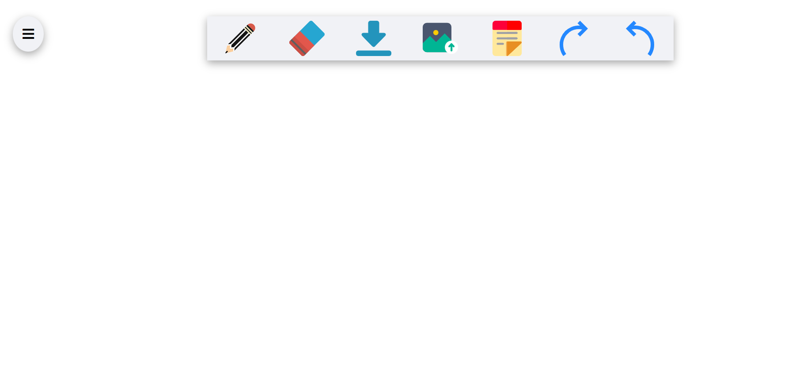
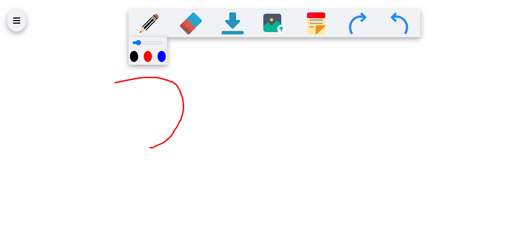
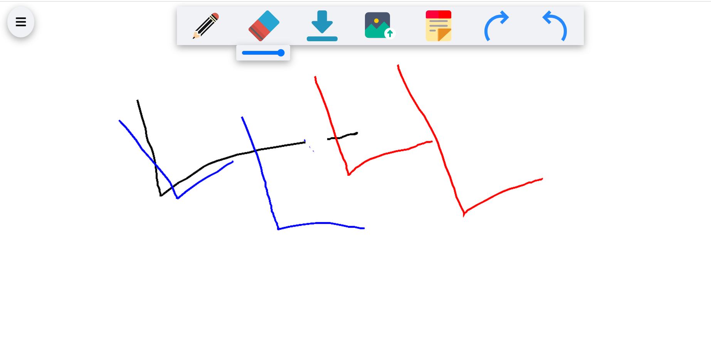
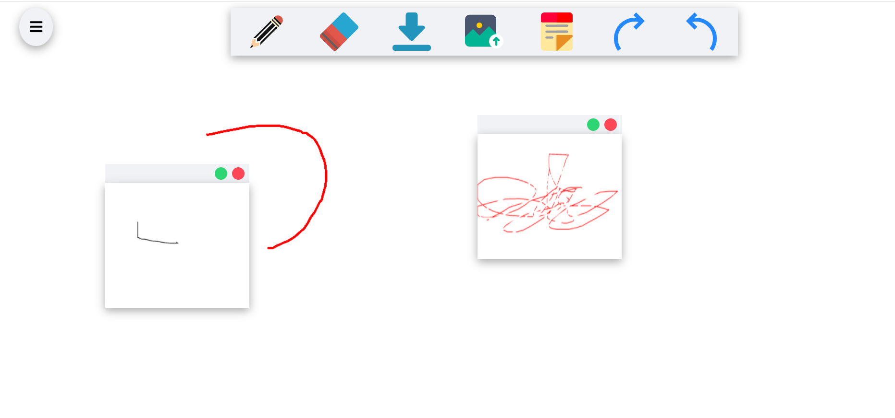
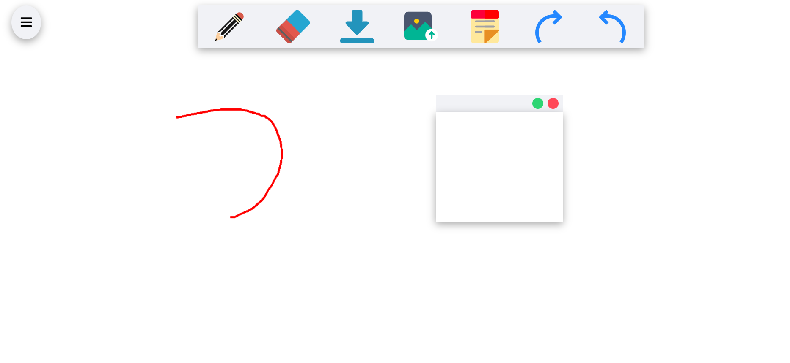

# [OpenBoard](https://openboard-app2.herokuapp.com/)

## Features

> - The usual open board with all feature like stylus, eraser, image upload, download and add Sticky.
> - It also has realtime sharing feature which is implemented with the help of socket.io.

## Tech Stack Used

> - HTML
> - CSS
> - Javascript
> - Canvas
> - Socket.io
> - Express

## Screenshot

> Home
> 

> Strokes
>  

> Add Image
> 

> Add Note
> 
